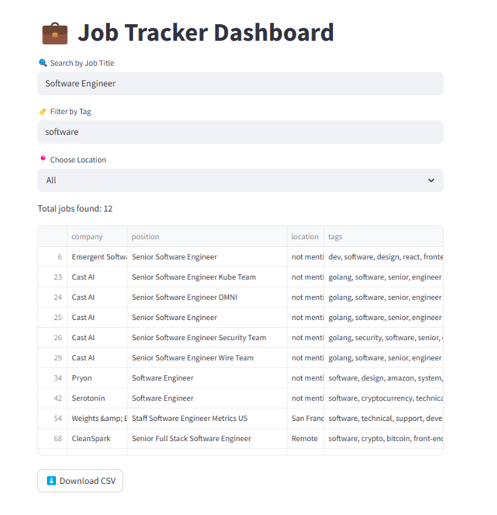

# Job Tracker ETL Project

A complete end-to-end ETL pipeline project that tracks remote job postings using the Remote OK API, transforms and stores the data in PostgreSQL, and presents it through an interactive Streamlit dashboard. The pipeline is scheduled with Apache Airflow, simulating a real-world data engineering workflow.

## 🚀 Project Overview

**Goal:** Build a fully automated pipeline to collect, clean, store, and visualize remote job data.

**Key Features:**
- Extract job data from Remote OK API
- Clean and transform data (formatting date, tags, salary)
- Store data in a PostgreSQL database
- Automate the pipeline with Airflow
- Build an interactive dashboard using Streamlit to explore job listings

---

## 📦 Tech Stack

- **Python**: Data extraction, transformation, and loading
- **Pandas**: Data cleaning and manipulation
- **PostgreSQL**: Data storage
- **Airflow**: Task scheduling and automation
- **Streamlit**: Interactive job dashboard

## 🧪 Sample Data Fields

- `job_id`
- `date_posted`
- `company`
- `position`
- `location`
- `tags`
- `salary`
- `url`

## 🧠 Learnings

- Designed modular ETL using Python
- Scheduled tasks with Airflow (DAGs, dependencies)
- Hands-on experience with PostgreSQL and DB operations
- Built a user-friendly interface with Streamlit
- Data quality and null handling in live data

## 🌐 Dashboard Preview

